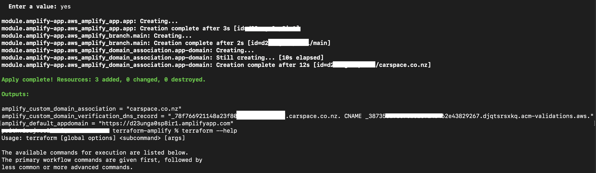
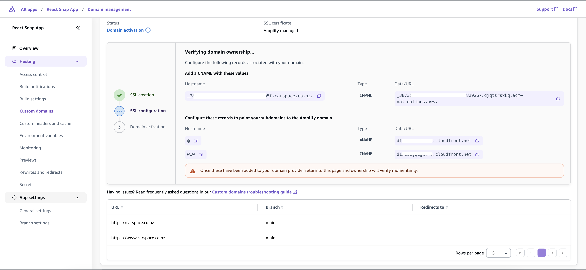

# AWS Amplify with Terraform 

## Table of Contents

- [About the Project](#about)
- [Getting Started](#getting-started)
- [Installation](#usage)


---

### About
This repository contains a fully customizable Terraform module designed to seamlessly deploy a React application on AWS using Amplify Hosting.

With this module, you can automate the entire process of provisioning AWS Amplify resource and deploying a React app. The module leverages the power of AWS Amplify for hosting, enabling quick, secure, and cost-effective hosting for your modern web applications.

### Features
- Automates the Amplify deployment.

### Built With

- [Terraform on AWS](https://registry.terraform.io/providers/hashicorp/aws/latest/docs)
- [Amplify Hosting](https://aws.amazon.com/amplify/hosting/)
- [AWS CLI](https://aws.amazon.com/cli/)
- [React](https://react.dev/)
 
---

## Getting Started

To quickly get started with this module, follow the step-by-step instructions outlined below.

### Prerequisites

List the software and versions required to use or contribute to the project.

- Terraform: `terraform >= 1.5.1`
- AWS CLI V2: `awscli >= 2`

### Installation

Step-by-step instructions to get started.

-> [Install AWS CLI](https://docs.aws.amazon.com/cli/latest/userguide/cli-configure-files.html)

-> [Configure AWS CLI](https://docs.aws.amazon.com/cli/v1/userguide/cli-chap-configure.html)

-> [Install and configure Terraform](https://www.terraform.io/)

```bash
# Clone the repository
git clone https://github.com/prithvirajsinghsolanki/terraform-amplify

# Navigate into the project directory
cd terraform-amplify

# Do not forget to update or change the amplify.yml in root directory as per your application framework, amplify.yml contains the buildspec code.

# Modify the varibles.tf file under ./modules/amplify-app-module/variables.tf
Update the varibles.tf as per your environment, below variables are required.

- source_repository
- github_access_token

# Initialize the Terraform module, with terraform init command,
user@home terraform-amplify % terraform init 

# Plan the terraform deployment
user@home terraform-amplify % terraform plan

# Apply the terraform plan,
user@home terraform-amplify % terraform apply

```

- After applying you will see the following output in the terminal.

    

- You can also find the DNS records on AWS Amplify console under custom domains,  Amplify Console -> All apps ->  Your App Name -> Custom domains

    

    update the CNAME records in your DNS console. Please refer to the following documentation for more details-

    https://docs.aws.amazon.com/amplify/latest/userguide/custom-domains.html


